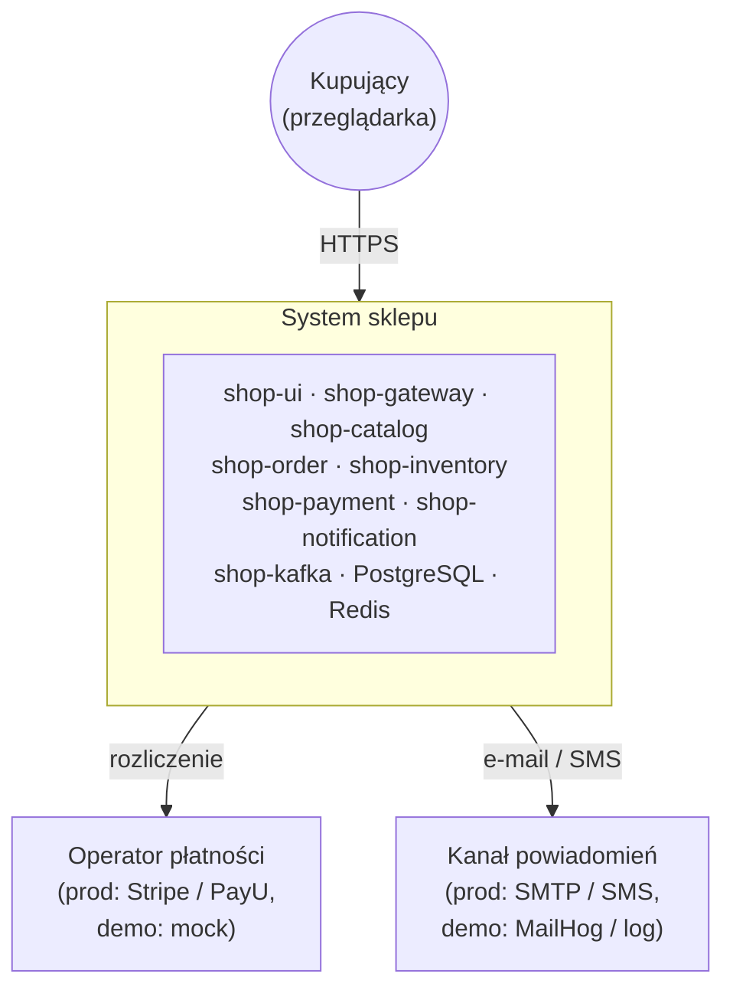
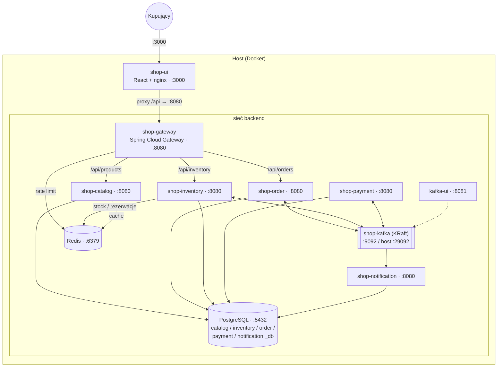
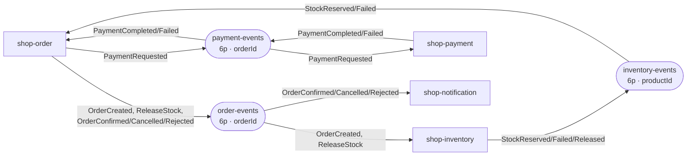
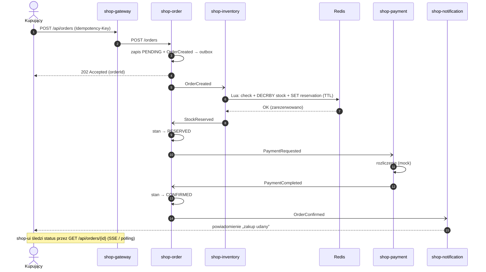
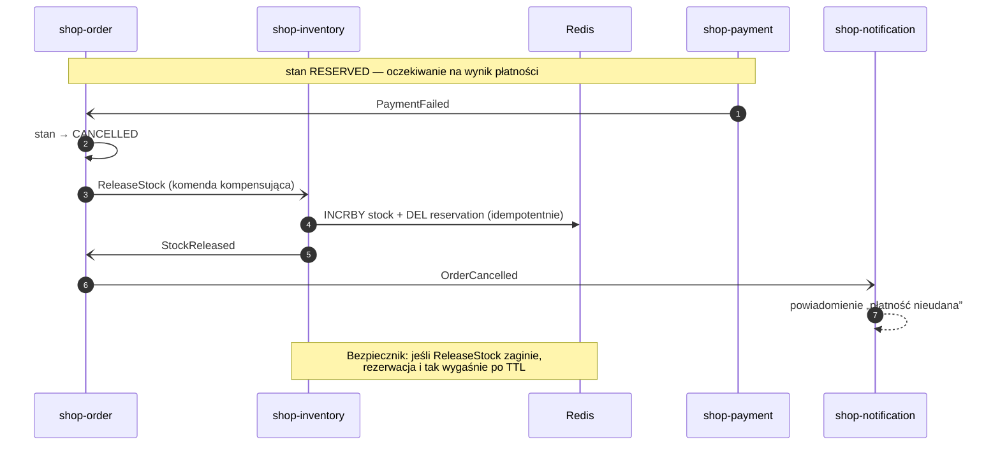
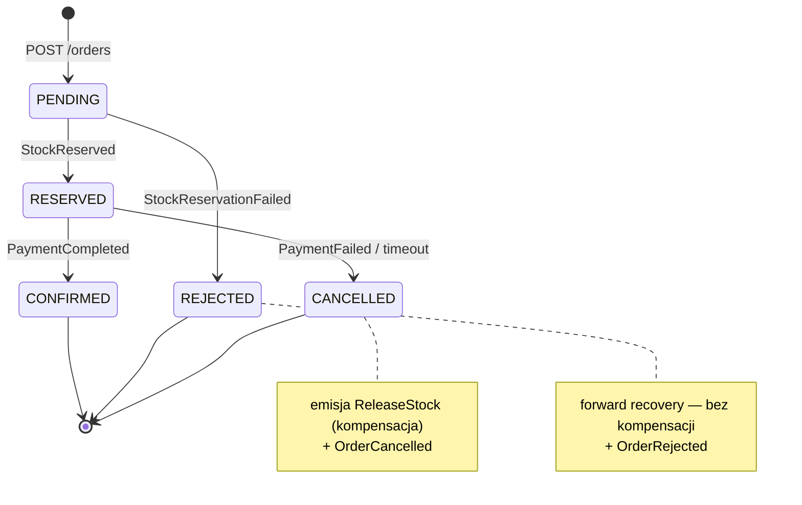

# Architektura — system sklepu (flash sale)

Diagramy architektury całego rozwiązania. Wszystkie wykresy są w składni
[Mermaid](https://mermaid.js.org) — renderują się natywnie na GitHubie i w wielu
edytorach Markdown. Opis tekstowy i mapy portów: zobacz [README.md](README.md).

Spis:
1. [Kontekst systemu](#1-kontekst-systemu)
2. [Komponenty i deployment](#2-komponenty-i-deployment)
3. [Przepływ zdarzeń Kafki](#3-przepływ-zdarzeń-kafki)
4. [Saga zakupu — ścieżka udana](#4-saga-zakupu--ścieżka-udana)
5. [Saga zakupu — kompensacja](#5-saga-zakupu--kompensacja)
6. [Maszyna stanów zamówienia](#6-maszyna-stanów-zamówienia)

---

## 1. Kontekst systemu

Kto i co styka się z systemem. W demie zależności zewnętrzne są zamockowane.

---

## 2. Komponenty i deployment

Kontenery uruchamiane przez `docker-compose.yml`, podział na sieci `frontend` i
`backend`. Tylko `shop-ui`, `shop-gateway` i narzędzia są wystawione na hosta —
serwisy backendu nasłuchują na `:8080` wyłącznie wewnątrz sieci `backend`.

---

## 3. Przepływ zdarzeń Kafki

Kto produkuje, a kto konsumuje poszczególne tematy. Klucz partycji w nawiasie —
`productId` na `inventory-events` gwarantuje kolejność zdarzeń per produkt.

> **Uwaga:** `shop-notification` **nie ma własnego tematu** — konsumuje terminalne
> zdarzenia `OrderConfirmed` / `OrderCancelled` / `OrderRejected` wprost z
> `order-events` (własna grupa konsumenta `shop-notification`). To zwykła
> subskrypcja zdarzeń domenowych, dzięki której `shop-order` pozostaje niezależny
> od powiadomień. Gdyby trzeba było odseparować ruch powiadomień (własna
> retencja/partycje, bogatsze komendy powiadomień), można dołożyć dedykowany temat
> wraz z producentem.
>
> Konsumpcja jest *at-least-once* → każdy konsument musi być **idempotentny**
> (`processed_events` / `sent_notifications`). Po wyczerpaniu prób zdarzenie ląduje
> na `<temat>.DLT`.

---

## 4. Saga zakupu — ścieżka udana

Orkiestracja przez `shop-order`. Odpowiedź dla klienta wraca od razu (`202`),
a dalsze kroki dzieją się asynchronicznie przez zdarzenia (strzałki przerywane).

---

## 5. Saga zakupu — kompensacja

Płatność odrzucona (lub timeout sagi) → `shop-order` cofa rezerwację komendą
`ReleaseStock`. Niezależny bezpiecznik: TTL rezerwacji w Redis.

Wariant **REJECTED** (brak towaru) nie wymaga kompensacji — to *forward recovery*:
`StockReservationFailed` → `shop-order` ustawia `REJECTED` i emituje `OrderRejected`
(brak rezerwacji do cofnięcia).

---

## 6. Maszyna stanów zamówienia

Stan i krok sagi są utrwalane w `order_db` (`saga_state`), więc po restarcie
serwis wznawia od miejsca przerwania.

