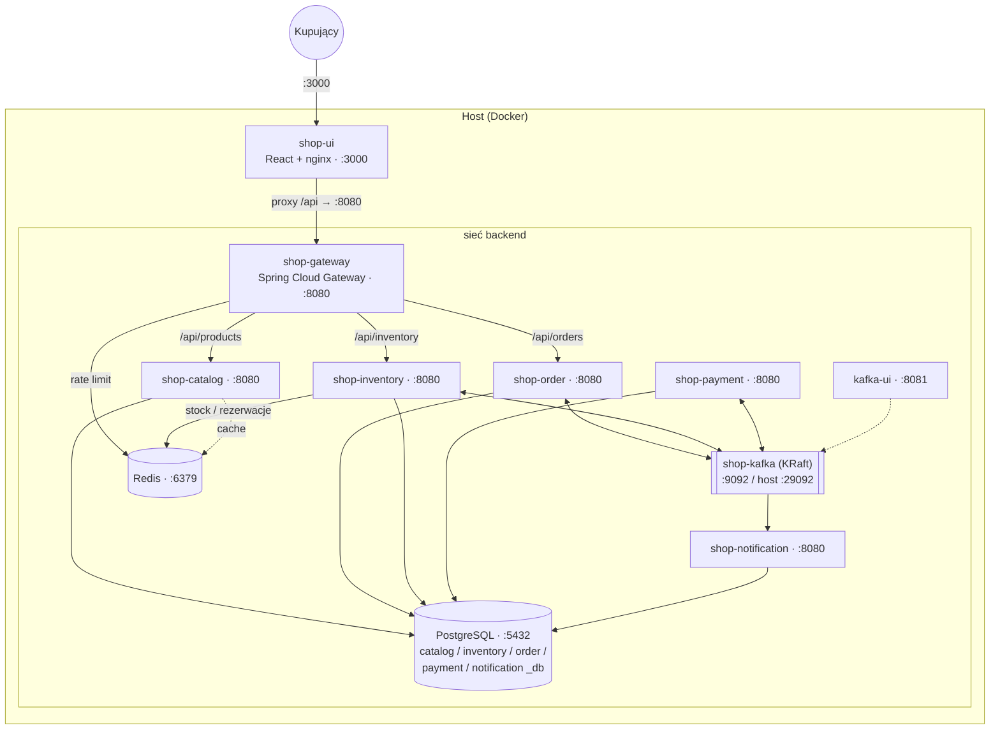
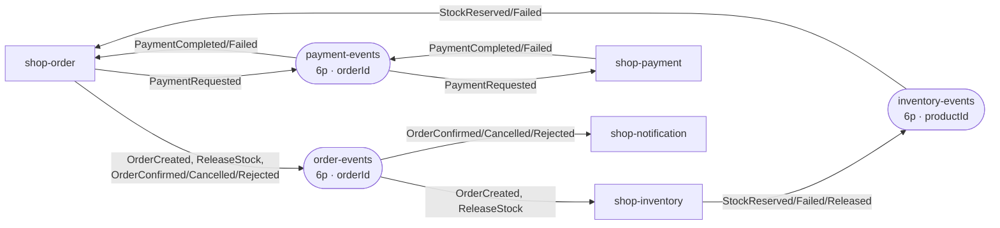
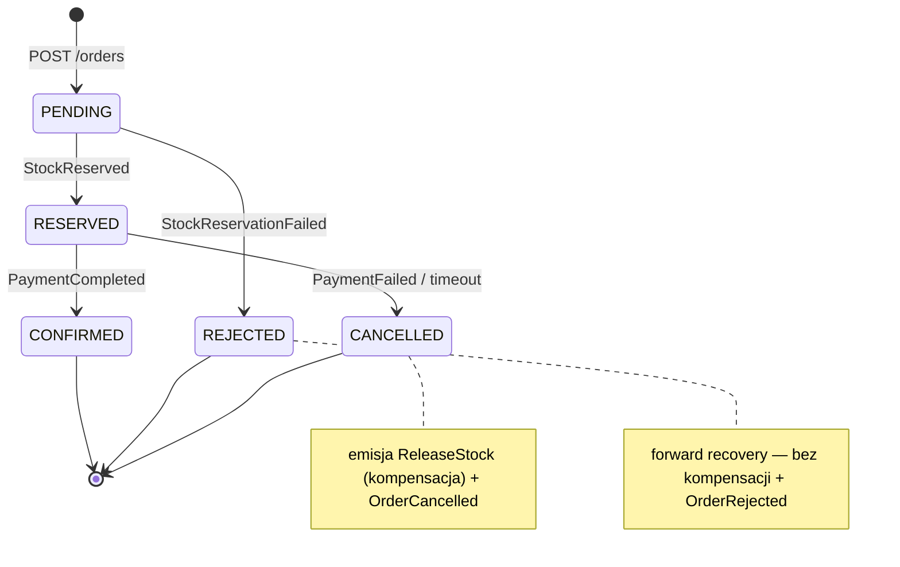

# shop-infra

Dokumentacja, diagramy, `docker-compose.yml` i Helm chart dla systemu sklepu (scenariusz *flash sale*).
To **nie jest serwis** — to centralny punkt orientacyjny całego playground.

Wszystkie repozytoria klonuj jako **siostrzane katalogi** w `ai-bot-playground/`.

## Repozytoria

| Repo | Rola |
|---|---|
| `shop-infra` | dokumentacja, diagramy, `docker-compose.yml`, Helm chart, skrypty preprod |
| `shop-gateway` | API Gateway (Spring Cloud Gateway) |
| `shop-catalog` | katalog produktów (read-heavy, cache Caffeine) |
| `shop-inventory` | magazyn i rezerwacje (atomowa rezerwacja Redis + Lua) |
| `shop-order` | zamówienia — orkiestrator sagi |
| `shop-payment` | płatności (mock PSP) |
| `shop-notification` | powiadomienia (konsument terminalnych zdarzeń) |
| `shop-kafka` | infrastruktura Kafki + kontrakty zdarzeń |
| `shop-postgres` | skrypt init baz (`database-per-service`) |
| `shop-redis` | konfiguracja Redis (stock, locki, cache) |
| `shop-ui` | frontend kupującego (React) |
| `shop-qa-ui` | narzędzie QA (Streamlit + LLM) — poza klastrem |
| `shop-token-metrics` | metryki zużycia tokenów LLM (Spring Boot + Micrometer) |
| `shop-acceptance-tests` | testy E2E (Cucumber + Testcontainers) |

**Stack serwisów:** Spring Boot 4.0.7 / Java 25 / Gradle 9.6. Każdy serwis (poza `shop-ui`) ma testy Cucumber + Testcontainers.

## System — przegląd


## Uruchomienie lokalne (docker compose)

```bash
cd shop-infra
docker compose up --build
```

Czysty restart: `docker compose down -v`. Skalowanie: `docker compose up --scale shop-inventory=3`.

Serwisy backendowe nasłuchują na `:8080` wewnątrz sieci `backend` — ruch publiczny idzie przez `shop-gateway`.

### Mapa portów

| Element | URL / port | Rola |
|---|---|---|
| shop-ui | http://localhost:3000 | UI kupującego |
| shop-gateway | http://localhost:8080 | publiczny punkt wejścia |
| kafka-ui | http://localhost:8081 | podgląd tematów |
| shop-kafka | localhost:29092 | lokalny dostęp |
| postgres | localhost:5432 | appuser/apppass |
| redis | localhost:6379 | stock, locki, cache |

## Architektura

### Komponenty i deployment

Kontenery `docker-compose.yml`, sieci `frontend` / `backend`. Na hosta wystawione tylko `shop-ui`, `shop-gateway` i narzędzia.



### Bazy danych (`database-per-service`)

| Baza | Kluczowe tabele |
|---|---|
| `catalog_db` | `products`, `categories` |
| `inventory_db` | `products(total_stock, version)`, `reservations`, `outbox`, `processed_events` |
| `order_db` | `orders(idempotency_key UNIQUE)`, `saga_state`, `outbox`, `processed_events` |
| `payment_db` | `payments(idempotency_key UNIQUE)`, `outbox` |
| `notification_db` | `sent_notifications(event_id PK)` |

### Tematy Kafki

| Temat | Partycje | Klucz | Zdarzenia |
|---|---|---|---|
| order-events | 6 | orderId | OrderCreated, OrderConfirmed, OrderCancelled, OrderRejected |
| inventory-events | 6 | productId | StockReserved, StockReservationFailed, StockReleased |
| payment-events | 6 | orderId | PaymentRequested, PaymentCompleted, PaymentFailed |
| `*.DLT` | 1 | — | Dead Letter Topic |

Klucz `productId` na `inventory-events` gwarantuje kolejność per produkt. Konsumpcja jest *at-least-once* → konsumenci muszą być idempotentni (`processed_events` / `sent_notifications`). Po wyczerpaniu prób → `<temat>.DLT`.
`shop-notification` nie ma własnego tematu — konsumuje terminalne zdarzenia bezpośrednio z `order-events` (własna grupa konsumenta).



## Saga zakupu

Odpowiedź `202` wraca od razu; kolejne kroki dzieją się asynchronicznie. Stan i krok sagi są utrwalone w `order_db.saga_state` — serwis wznawia po restarcie.

- **Happy path:** `POST /orders` → `OrderCreated` → rezerwacja Redis (Lua: check + DECRBY + SET reservation z TTL) → `StockReserved` → `PaymentRequested` → `PaymentCompleted` → `OrderConfirmed`
- **Kompensacja (płatność odrzucona):** `PaymentFailed` → `CANCELLED` + `ReleaseStock` (INCRBY + DEL reservation, idempotentnie) → stock wraca. Bezpiecznik: TTL rezerwacji w Redis (jeśli `ReleaseStock` zaginie, rezerwacja i tak wygaśnie).
- **Brak towaru:** `StockReservationFailed` → `REJECTED` (forward recovery, bez kompensacji — brak rezerwacji do cofnięcia).



## Obserwowalność zużycia tokenów LLM

`shop-qa-ui` (Streamlit) woła LLM i raportuje zużycie tokenów do `shop-token-metrics` (Spring Boot + Micrometer → `/actuator/prometheus`). Prometheus scrapuje, Grafana rysuje dashboard *„LLM Token Usage"*.

Liczniki: `llm_tokens_total{type,model,source}`, `llm_requests_total{model,source}`, `llm_cost_usd_total{model,source}`.

## Status implementacji

Wszystko zmergowane do `main`. Zaimplementowane:

| Serwis | Zakres |
|---|---|
| shop-catalog | REST + JPA + Flyway (seed) + Caffeine cache + test-support `POST/DELETE /products` |
| shop-inventory | atomowa rezerwacja Redis (Lua) + JPA + outbox + idempotencja + Kafka |
| shop-order | REST `POST/GET /orders` + saga + Kafka + outbox multi-topic + idempotencja + timeout-scanner |
| shop-payment | mock PSP (failure-rate + hook `cents%100==66`) + idempotencja + outbox + Kafka |
| shop-notification | konsumpcja terminalnych `Order*` + idempotentny send (`sent_notifications`) |
| shop-ui | lista produktów + zakup (Idempotency-Key) + status (polling) |

**E2E:** 3/3 scenariusze (happy path, out of stock, payment declined). `shop-ui` nie jest bramkowany suitem E2E — jego spec to `shop-ui/features/shopping-journey.feature`.

## Testy komponentowe (lokalnie)

Wymagane: Podman Desktop z włączoną „Docker compatibility".

```powershell
cd shop-catalog    # lub dowolny serwis
.\gradlew.bat test
# Jeśli Ryuk sprawia problemy:
$env:TESTCONTAINERS_RYUK_DISABLED = "true"; .\gradlew.bat test
```

### Gotchas Boot 4 / Spring Cloud 2025.1 (wyłapane przez E2E)

- **Kafka:** `spring-kafka` nie włącza `KafkaAutoConfiguration` → potrzebne `spring-boot-starter-kafka` (order/payment/inventory/notification).
- **Gateway:** Spring Cloud Gateway 2025.1 czyta trasy pod `spring.cloud.gateway.server.webflux.routes` (stary `spring.cloud.gateway.routes` → 404).
- **Jackson 3:** deserializacja do Jackson-2 `JsonNode` przez `RestClient` → `InvalidDefinitionException`. Fix: deserializacja do `Map`.
- **Kafka probe:** `kafka-broker-api-versions.sh` jako exec-probe przekracza `timeoutSeconds=1` → crashloop. Fix: `tcpSocket` na 9092.

## Preprod (kind) i bramka CI

PR do `main` jest bramkowany pełnym E2E na lokalnym klastrze `kind-preprod`. Gate działa na maszynie dewelopera. Kolejność startu: **podman → kind → runner**.

```powershell
# 1) podman machine (Docker compatibility ON — wymagane przez Testcontainers)
podman machine start

# 2) klaster kind
$env:KIND_EXPERIMENTAL_PROVIDER = "podman"
podman start preprod-control-plane
kubectl --context kind-preprod get nodes        # STATUS = Ready

# 3) deploy stacku (Helm)
helm upgrade --install shop ./helm --kube-context kind-preprod -n shop --create-namespace `
  -f ./helm/values.yaml -f ./helm/values-preprod.yaml --timeout 6m

# 4) runnery (jeden per repo serwisowe)
.\register-preprod-runners.ps1 -Start
```

Skrypty pomocnicze: `deploy-preprod.ps1`, `register-preprod-runners.ps1`, `port-forward-ui.ps1`.

**Jak działa gate:** `pr-to-main.yml` (`on: pull_request`) → check `preprod-gate / gate` na runnerze `[self-hosted, <svc>]`. Mutex `Global\shop-preprod-gate` serializuje równoległe PR. Checkout 3 repo (kandydat, `shop-infra`, `shop-acceptance-tests`) → `podman build` → `kind load` → `helm upgrade` (baseline) → `kubectl set image` + `rollout status` → port-forward + `./gradlew test`. Zielone = PR odblokowany.

Repozytoria z runnerami: `shop-gateway`, `shop-catalog`, `shop-inventory`, `shop-order`, `shop-payment`, `shop-notification`, `shop-token-metrics`.

### Port-forward UI (kind-preprod)

```powershell
.\port-forward-ui.ps1    # shop-ui (3001) + shop-token-metrics (8088) w jednym oknie
# Grafana: kubectl --context kind-preprod -n shop port-forward svc/grafana 3000:3000
```

`shop-qa-ui` działa lokalnie (nie w klastrze): `cd ../shop-qa-ui; streamlit run app.py --server.port 8501`.

### Gotchas gate'u

- **Shell:** gate używa `defaults.run.shell: powershell`. Na Windows `shell: bash` = WSL launcher → brak podman/kubectl.
- **Zawsze z `main`:** kandydat testowany przeciwko bieżącemu `main` (`gate.yml@main`, `ref: main` dla shop-infra i shop-acceptance-tests).
- **Publiczne repo:** GitHub ostrzega przed self-hosted runnerami w publicznych repach (fork może uruchomić kod). Rozwiązanie: repo prywatne.
- **Reboot:** nic nie startuje samo (`restart=no`) — podman machine i kontenery kind wymagają ręcznego startu. `podman machine stop` zatrzymuje też kontenery kind.
