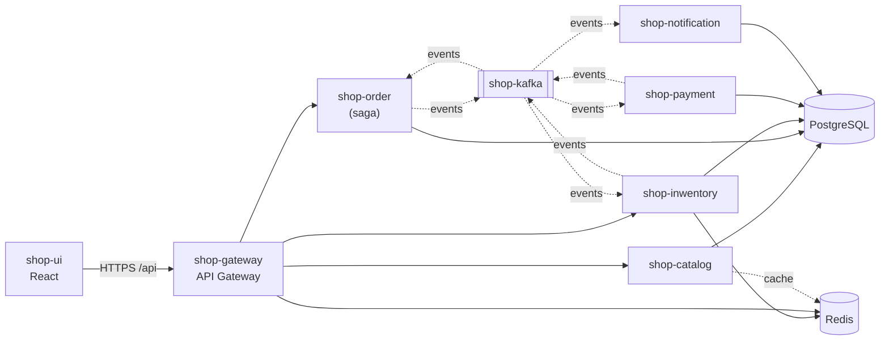

# shop-documentation

Repozytorium spinające cały system sklepu (scenariusz *flash sale* — ograniczony
towar, tysiące jednoczesnych kupujących). To **nie jest serwis** — trzyma
dokumentację architektury, [diagramy](ARCHITECTURE.md) oraz `docker-compose.yml`,
który uruchamia cały stack na lokalnym Dockerze.

> **Stan projektu:** faza projektowa/spec. Każde repo trzyma na razie `README`
> z opisem „co i jak zaimplementować”. Ten dokument opisuje architekturę docelową.

## Diagramy

Komplet diagramów (kontekst systemu, komponenty/deployment, sekwencje sagi,
maszyna stanów zamówienia, przepływ zdarzeń Kafki) znajduje się w
**[ARCHITECTURE.md](ARCHITECTURE.md)**. Poniżej skrócona mapa systemu:



## Repozytoria systemu

System jest w układzie polirepo — każdy serwis to osobne repo GitHub:

| Repo                | Rola                                                    |
|---------------------|---------------------------------------------------------|
| `shop-documentation`| dokumentacja, diagramy, `docker-compose.yml`            |
| `shop-gateway`      | API Gateway — publiczny punkt wejścia                   |
| `shop-catalog`      | katalog produktów (read-heavy)                          |
| `shop-inwentory`    | magazyn i rezerwacje — serce współbieżności             |
| `shop-order`        | zamówienia — orkiestrator sagi                          |
| `shop-payment`      | płatności (mock z konfigurowalnym odsetkiem odrzuceń)   |
| `shop-notification` | powiadomienia (e-mail / SMS)                            |
| `shop-kafka`        | infrastruktura Kafki: tematy + biblioteka kontraktów zdarzeń |
| `shop-postgres`     | PostgreSQL — skrypt inicjujący bazy (`database-per-service`) |
| `shop-redis`        | Redis — gorąca ścieżka rezerwacji stocku + rate limiting |
| `shop-ui`           | frontend (React)                                        |

PostgreSQL i Redis korzystają ze standardowych obrazów, ale mają teraz własne
repozytoria (`shop-postgres`, `shop-redis`) trzymające ich konfigurację — np.
skrypt `shop-postgres/01-create-databases.sql` zakładający osobną bazę per serwis.
`docker-compose.yml` w tym repo montuje tę konfigurację do odpowiednich kontenerów.

## Układ katalogów do uruchomienia lokalnie

`docker-compose.yml` buduje pozostałe repozytoria jako katalogi **siostrzane**
(`build: ../shop-*`) i montuje konfigurację z `../shop-postgres` / `../shop-redis`.
Sklonuj wszystko obok siebie:

```
ai-bot-playground/         <- katalog nadrzędny (workspace)
├── shop-documentation/    <- tu uruchamiasz `docker compose up`
├── shop-gateway/
├── shop-catalog/
├── shop-inwentory/
├── shop-order/
├── shop-payment/
├── shop-notification/
├── shop-kafka/
├── shop-postgres/
├── shop-redis/
└── shop-ui/
```

## Uruchomienie

```bash
cd shop-documentation
docker compose up --build
```

`shop-kafka-init` tworzy tematy i kończy działanie (to normalne). Czysty restart
kasujący dane: `docker compose down -v`. Skalowanie konsumenta:
`docker compose up --scale shop-inwentory=3`.

## Mapa portów

| Element       | URL / port hosta        | Rola                                   |
|---------------|-------------------------|----------------------------------------|
| shop-ui       | http://localhost:3000   | UI kupującego                          |
| shop-gateway  | http://localhost:8080   | publiczny punkt wejścia                |
| kafka-ui      | http://localhost:8081   | podgląd tematów i consumer lag         |
| shop-kafka    | localhost:29092         | dostęp z narzędzi lokalnych            |
| postgres      | localhost:5432          | bazy (appuser/apppass)                 |
| redis         | localhost:6379          | licznik stocku, locki, cache           |

Serwisy `shop-catalog/-inwentory/-order/-payment/-notification` nasłuchują na
8080 wewnątrz sieci `backend` i nie są wystawione na hosta — ruch idzie przez `shop-gateway`.

## Bazy danych (database-per-service)

Każdy serwis ma własną, izolowaną bazę — nikt nie zagląda do cudzej. W demie jeden
silnik Postgresa z wieloma bazami (zakładanymi przez `shop-postgres`), produkcyjnie
osobne instancje.

| Baza              | Serwis              | Kluczowe tabele                                          |
|-------------------|---------------------|----------------------------------------------------------|
| `catalog_db`      | shop-catalog        | `products`, `categories`                                 |
| `inventory_db`    | shop-inwentory      | `products(total_stock, version)`, `reservations`, `outbox`, `processed_events` |
| `order_db`        | shop-order          | `orders(idempotency_key UNIQUE)`, `order_items`, `saga_state`, `outbox`, `processed_events` |
| `payment_db`      | shop-payment        | `payments(idempotency_key UNIQUE)`, `outbox`             |
| `notification_db` | shop-notification   | `sent_notifications(event_id PK)`                        |

## Tematy Kafki

| Temat                | Partycje | Klucz     | Główne zdarzenia                                   |
|----------------------|----------|-----------|----------------------------------------------------|
| order-events         | 6        | orderId   | OrderCreated, OrderConfirmed, OrderCancelled, OrderRejected |
| inventory-events     | 6        | productId | StockReserved, StockReservationFailed, StockReleased |
| payment-events       | 6        | orderId   | PaymentRequested, PaymentCompleted, PaymentFailed  |
| `*.DLT`              | 1        | —         | Dead Letter Topic                                  |

`shop-notification` **nie ma osobnego tematu** — konsumuje terminalne zdarzenia
`OrderConfirmed` / `OrderCancelled` / `OrderRejected` wprost z `order-events`
(własna grupa konsumenta `shop-notification`). To zwykła subskrypcja zdarzeń
domenowych: `shop-order` pozostaje niezależny od powiadomień. Gdyby w przyszłości
trzeba było odseparować ruch powiadomień (własna retencja/partycje, bogatsze
komendy), można dołożyć dedykowany temat + producenta.

Szczegóły producentów/konsumentów per temat oraz diagram przepływu zdarzeń:
zobacz [ARCHITECTURE.md](ARCHITECTURE.md).

## Przepływ zakupu (saga, orkiestracja przez shop-order)

Ścieżka udana: `POST /orders` → OrderCreated → shop-inwentory rezerwuje (Redis) →
StockReserved → PaymentRequested → shop-payment pobiera → PaymentCompleted →
OrderConfirmed → shop-notification wysyła potwierdzenie.

Kompensacja (płatność odrzucona): PaymentFailed → shop-order anuluje (CANCELLED)
+ emituje `ReleaseStock` → shop-inwentory zwalnia rezerwację (stock wraca do
puli) → shop-notification informuje. Bezpiecznik: rezerwacja w Redis ma TTL, więc
przy zgubionym zdarzeniu i tak wygasa.

Pełne diagramy sekwencji (ścieżka udana + kompensacja) i maszyna stanów
zamówienia: [ARCHITECTURE.md](ARCHITECTURE.md).

## Skalowanie do tysięcy użytkowników

- Serwisy bezstanowe → skalowanie poziome (`--scale`, docelowo HPA w Kubernetes).
- Równoległość przez partycje Kafki: liczba instancji konsumenta ≤ liczba partycji.
- Gorąca ścieżka rezerwacji w Redis (atomowy Lua), nie w bazie SQL.
- Rate limiting na shop-gateway chroni backend przed nadmiarowym ruchem.

## Obserwowalność (rozszerzenie)

Prometheus + Grafana (Micrometer wystawia `/actuator/prometheus`), tracing przez
OpenTelemetry. Testy obciążeniowe: k6 lub Gatling symulujące tysiące
równoczesnych zakupów jednego produktu.
